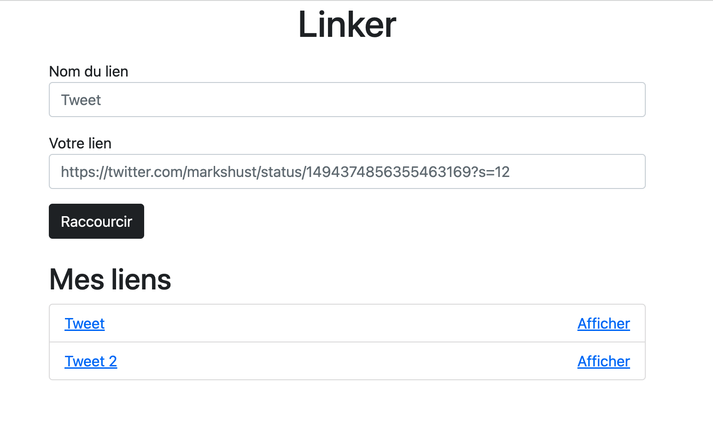
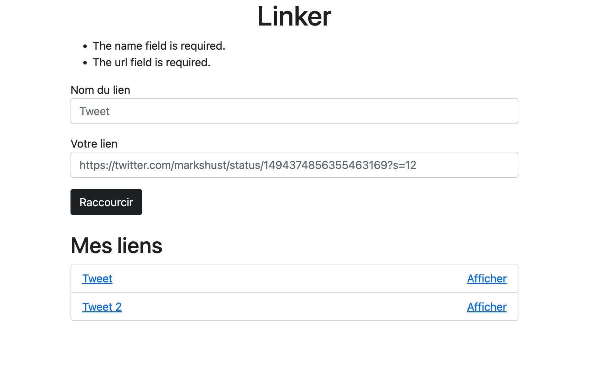
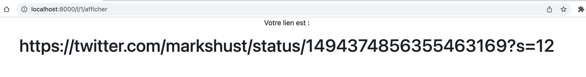

# TP Linker

Vous allez créer un nouveau projet Laravel. Nous le nommerons linker. L'objectif est de pouvoir stocker des liens dans une base de données (comme des favoris) et de les raccourcir. Par exemple, on stocke https://twitter.com/markshust/status/1494374856355463169?s=12 et http://localhost:8000/l/1 renvoie vers ce lien.

## Créer le projet Laravel

Vous commencerez par créer le projet Laravel avec composer. Vous n'êtes pas obligé d'utiliser git.

## Les routes

Il nous faut 3 routes pour ce projet :

- `/` pour afficher la liste des liens et afficher un formulaire
- `/l/{id}/afficher` permettra de voir le lien réel sur une page
- `/l/{id}` pour aller récupèrer le lien dans la BDD et rediriger vers ce lien

Bien entendu, vous devrez créer un template (layout) commun à toutes les pages. Vous pouvez utiliser Bootstrap en ajoutant le CDN (ou Tailwind !).

## Les migrations

Il faudra créer une migration pour créer la table `links`. On a simplement besoin de stocker un lien et son nom donc il y a une colonne `name` et `url`.

## Le modèle

On a besoin d'un modèle `Link`. On n'oublie pas le `$fillable`. L'action du formulaire pointera sur `/lien/creer`. On validera bien que le lien est une url à la création et que le nom fasse au moins 2 caractères. Vous pouvez essayer de voir s'il y a moyen de valider une URL sur la documentation de Laravel. On aura la route suivante pour traiter le formulaire :

- `/lien/creer` (en POST) pour pouvoir créer un lien dans la BDD

## Option: Le contrôleur

Idéalement, vous rangerez votre code dans un contrôleur `LinkController`.

## Le résultat

Voilà le résultat attendu :

